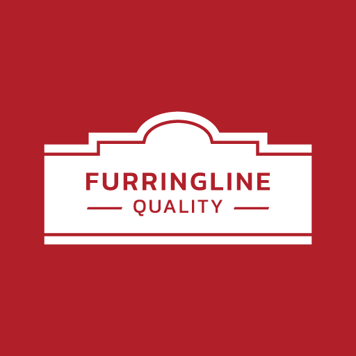

# FURRINGLINE MCP

Connect your AI assistant to **FURRINGLINE**, a building-materials supplier in Thailand. It can search the product catalog (gypsum boards, ceiling and wall framing, T-bar ceilings, insulation, fixings, tools), show prices before VAT and live stock, and run the material calculators from [furringline.com](https://furringline.com/calculator/).

- **Server:** `https://mcp.furringline.com` (remote MCP, Streamable HTTP)
- **Sign-in:** none. Read-only: nothing is ordered, saved or changed.
- **Setup guide:** https://mcp.furringline.com/docs · **Privacy:** https://mcp.furringline.com/privacy · **Terms:** https://mcp.furringline.com/terms

This repository holds only the install files for AI tools. It contains no server code.

## Tools

| Tool | What it does |
| --- | --- |
| `search_products` | Search by Thai or English words, SKU or category. |
| `get_product` | One product in full, with every option's SKU, price and stock. |
| `list_categories` | Product categories with counts. |
| `list_calculators` | The 15 material calculators (ceilings, walls, insulation). |
| `calculate_materials` | Materials, quantities, prices before VAT and totals for an area in m². |

Prices are in Thai baht, before 7% VAT and indicative. Only a formal FURRINGLINE quotation is binding.

## Install

| Tool | How |
| --- | --- |
| Claude | Settings → Connectors → Add custom connector → `https://mcp.furringline.com` |
| Claude Code | `claude mcp add --transport http furringline https://mcp.furringline.com` |
| ChatGPT / Codex | Find "FURRINGLINE" in the plugin directory, or `codex mcp add furringline --url https://mcp.furringline.com` |
| Cursor | Cursor Marketplace, or [Add to Cursor](https://mcp.furringline.com/docs) |
| Gemini CLI | `gemini extensions install https://github.com/nueyprap/furringline-mcp` |
| Grok | grok.com → Connectors → New Connector → Custom → `https://mcp.furringline.com` |
| Hermes Agent | `~/.hermes/config.yaml`: `mcp_servers: { furringline: { url: "https://mcp.furringline.com" } }` |
| Any MCP client | Remote HTTP server `https://mcp.furringline.com`, no headers |

## Files

- `mcp.json`, `.cursor-plugin/plugin.json`: Cursor plugin.
- `.mcp.json`, `.claude-plugin/plugin.json`: Claude Code plugin.
- `gemini-extension.json`, `GEMINI.md`: Gemini CLI extension.
- `server.json`: entry for the official MCP Registry (`com.furringline.mcp/furringline`).

## Support

hello@furringline.com · 02-921-7900 · LINE [@furringline](https://line.me/R/ti/p/%40furringline)
